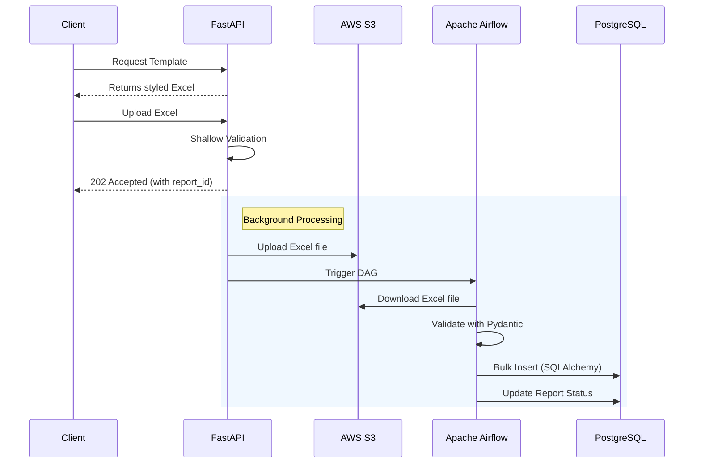

# NexAmaze Bulk Upload Service

## Overview
An async monorepo for high-volume Excel data ingestion. I designed and built this at Advika Innovate. It processes 10K+ records/day with <100ms API response by offloading CPU-bound parsing to Apache Airflow workers.

## Architecture

## Tech Stack

| Technology | Purpose | Why I Chose It |
| :--- | :--- | :--- |
| **FastAPI** | API Gateway | High performance, built-in async support, and excellent OpenAPI integration. |
| **Apache Airflow 3.1** | Background Workflow Engine | Robust DAG management, retry mechanisms, and scalable worker execution. |
| **Polars** | Data Processing | Rust-backed DataFrame library; handles large datasets significantly faster than Pandas. |
| **fastexcel** | Excel Parsing | Extremely fast reading of Excel files natively in Rust/Python. |
| **PostgreSQL** | Primary Database | ACID compliance and robust support for bulk operations. |
| **AWS S3** | Object Storage | Reliable, scalable storage for incoming Excel files before processing. |
| **Pydantic** | Data Validation | Strict row-level validation ensuring data integrity before database insertion. |
| **SQLAlchemy** | ORM / DB Access | Efficient connection pooling and `bulk_insert_mappings` support. |
| **aioboto3** | AWS SDK | Async operations for non-blocking S3 uploads from FastAPI. |
| **xlsxwriter** | Template Generation | Rich formatting capabilities for generating styled Excel templates. |

## Key Design Decisions

* **Declarative configuration (`STATIC_MAPPINGS`):** Enables 15-min feature additions by abstracting mapping logic instead of writing imperative code.
* **Replaced pandas with Rust-backed Polars:** Achieved 10x+ faster parsing times for large datasets.
* **Custom `BulkInserter` with SQLAlchemy `bulk_insert_mappings`:** Reduced database round-trips from O(N) to O(1).
* **Pydantic row-level validation:** Prevented partial transaction failures by enforcing strict type schemas and constraints before any DB writes occur.

## Performance Results

* **10K+ records/day processed**
* **<100ms API response** regardless of file size
* **50K+ row Excel files parsed in seconds**
* **90% reduction in manual data entry**

## My Role
Designed and built end-to-end. Owned architecture from database schema to deployment.

## What I'd Improve Next
* Add a user dashboard, implement pytest suite, add S3 lifecycle policies for cleanup.
