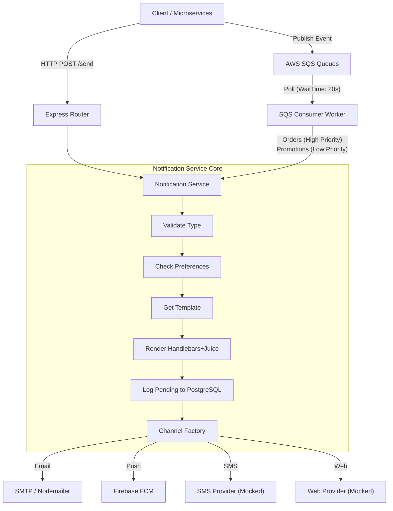

# DealAmaze Notification Service

## Overview
An event-driven microservice powering e-commerce notifications (Email, Push, SMS, Web) for DealAmaze (dealamaze.in). Built to handle synchronous HTTP API requests and asynchronous SQS queue processing, it achieves <100ms API response times by offloading message dispatching to background workers.

## Architecture

## Tech Stack

| Technology | Purpose |
|------------|---------|
| **Node.js & Express.js v5.1** | Core API framework and routing |
| **PostgreSQL & Sequelize** | Relational data persistence and ORM |
| **AWS SQS** | Asynchronous message queuing |
| **Firebase Admin SDK** | FCM push notification delivery |
| **Nodemailer** | SMTP email dispatch |
| **Handlebars & Juice** | Dynamic email templating and CSS inlining |
| **Pino & Joi** | Structured zero-I/O JSON logging and schema validation |

## Key Design Decisions
- **Dual-Mode Processing**: Supports both sync HTTP for instant alerts and async SQS for high-throughput batching.
- **Provider Factory Pattern**: Enables pluggable notification channels (Email, Push, SMS, Web) without modifying core logic.
- **Intelligent Error Handling**: Distinguishes between retriable errors (DB failures, network timeouts) and permanent failures (invalid templates).
- **FCM Token Auto-Cleanup**: Automatically purges stale device tokens to reduce database bloat.
- **Cost-Optimized Polling**: Uses long-polling (`WaitTimeSeconds: 20`) to minimize empty SQS receives and AWS costs.
- **High-Performance Logging**: Utilizes Pino for structured JSON logging to eliminate I/O bottlenecks.

## Performance Results
- **<100ms** API response times for synchronous requests.
- **10K+** messages processed daily via asynchronous background workers.
- Implemented **`Promise.all`** batch processing for highly concurrent message dispatch.
- **Zero impact** on upstream checkout and billing services during high-traffic spikes.

## My Role
Designed and built the notification microservice end-to-end. Owned the system architecture, provider factory implementation, and SQS background worker integration.

## What I'd Improve Next
- Integrate a live SMS provider to replace the mocked implementation.
- Add WebSocket or SSE (Server-Sent Events) for real-time web notifications.
- Implement advanced rate-limiting and exponential backoff for SQS retries.
